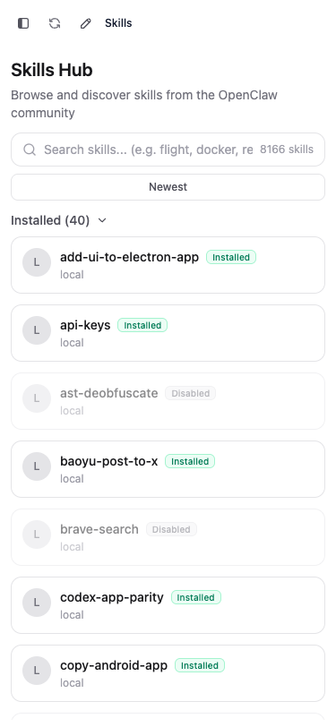
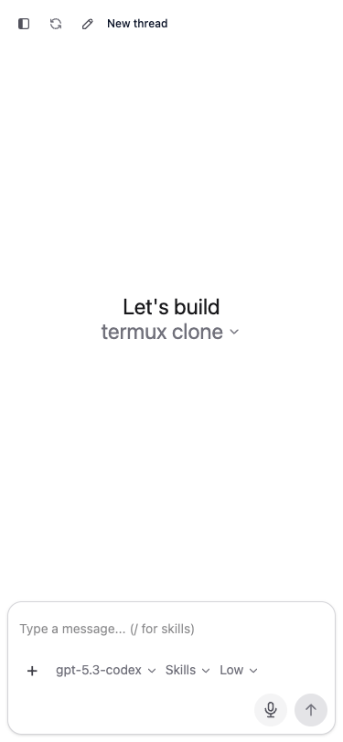

# 🔥 codexapp

### 🚀 Run Codex App UI Anywhere: Linux, Windows, or Termux on Android 🚀

[](https://www.npmjs.com/package/codexapp)
[](#-quick-start)
[](https://nodejs.org/)
[](./LICENSE)

> **Codex UI in your browser. No drama. One command.**
>  
> **Yes, that is your Codex desktop app experience exposed over web UI. Yes, it runs cross-platform.**

## 本分支相对原仓库的修改与优化

本仓库是在上游 `codex-mobile` 基础上维护的 Codex 专用远程显示与交互分支，
重点是让浏览器（手机、桌面端）和同一台机器上的官方 Codex 客户端共享真实的
Codex 会话，而不是把项目变成另一个独立的多模型平台。

- **官方 app-server 共享连接**：默认连接
  `$CODEX_HOME/app-server-control/app-server-control.sock`，通过官方
  `codex app-server proxy` 转发，不修改 Desktop 配置，不注入新的 provider、模型或权限策略。
- **官方服务自动引导**：标准 socket 尚未启动时，自动启动官方
  `codex app-server --listen unix://`，等待 socket 就绪后再连接；不会启动旧版
  standalone 替代服务，也不会创建第二套 Codex 会话状态。
- **跨客户端同步**：网页端与官方 Codex 客户端共享项目、历史对话、运行状态、审批/输入请求和任务事件；
  支持 Desktop/手机同时观察同一任务。
- **任务与发送稳定性**：统一排队、发送、引导（steer）、停止（interrupt）路由，处理重复提交、
  服务重启恢复、writer 冲突和空闲会话误入队列等情况。
- **历史记录与切换性能**：项目/线程分页、快速状态投影、延迟加载大型历史对话，减少切换会话时的卡顿和状态回退。
- **移动端体验**：任务活动时间线、运行中状态展示、审批和用户输入卡片、侧栏状态同步，以及输入框安全区域优化。
- **兼容原有功能**：保留上游的项目管理、Skills、文件浏览、导入导出、Telegram 和隧道能力；
  账号刷新所需的临时隔离 app-server 仍然保留。

### 推荐的源码启动方式

```bash
pnpm install
pnpm run build
node dist-cli/index.js --no-tunnel --port 5900
```

默认情况下不需要手动查找或填写 app-server socket。只要官方 Codex CLI 和登录配置正常，
首次请求会自动连接现有官方服务，或按需启动它。

```text
 ██████╗ ██████╗ ██████╗ ███████╗██╗  ██╗██╗   ██╗██╗
██╔════╝██╔═══██╗██╔══██╗██╔════╝╚██╗██╔╝██║   ██║██║
██║     ██║   ██║██║  ██║█████╗   ╚███╔╝ ██║   ██║██║
██║     ██║   ██║██║  ██║██╔══╝   ██╔██╗ ██║   ██║██║
╚██████╗╚██████╔╝██████╔╝███████╗██╔╝ ██╗╚██████╔╝██║
 ╚═════╝ ╚═════╝ ╚═════╝ ╚══════╝╚═╝  ╚═╝ ╚═════╝ ╚═╝
```

---


## 🤯 What Is This?
**`codexapp`** is a lightweight bridge that gives you a browser-accessible UI for Codex app-server workflows.

You run one command. It starts a local web server. You open it from your machine, your LAN, or wherever your setup allows.  

**TL;DR 🧠: Codex app UI, unlocked for Linux, Windows, and Termux-powered Android setups.**

---

## ⚡ Quick Start
> **The main event.**

```bash
# 🔓 Start the shared web bridge (uses the official socket by default)
npx codexapp --no-tunnel --port 5900

# 🌐 Then open in browser
# http://localhost:5900
```

By default, `codexapp` now also starts:

```bash
cloudflared tunnel --url http://localhost:<port>
```

It prints the tunnel URL, terminal QR code, and password together in startup output.  
Use `--no-tunnel` to disable this behavior.

If you are using a provider or AI gateway that is already authenticated and do not want `codexapp` to force `codex login` during startup, use:

```bash
npx codexapp --no-login
```

### Use the official Codex app-server (required)

This branch does not start a second app-server. It attaches to the existing
official Codex app-server on the Ubuntu host and uses the official CLI proxy
command, so Desktop and the web UI share provider configuration, permissions,
conversation state, and task events:

```bash
npx codexapp --no-tunnel --port 5900
```

The official app-server socket is used directly. If it is not running yet,
codexapp starts the official `codex app-server --listen unix://` process,
waits for the standard socket, and then connects through the official proxy.
You can use the equivalent CLI option to point at a non-default socket:

```bash
npx codexapp --app-server-socket "$HOME/.codex/app-server-control/app-server-control.sock"
```

By default codexapp uses `$CODEX_HOME/app-server-control/app-server-control.sock`
(`~/.codex/app-server-control/app-server-control.sock` when `CODEX_HOME` is not
set). Override it with `CODEXUI_APP_SERVER_SOCKET` or
`--app-server-socket` when the official socket lives elsewhere. If startup
fails, the web service remains available for diagnostics and reports the
official app-server error; codexapp never starts a separate replacement
bridge. Once the official socket is available, retry the request and
codexapp reconnects through the proxy. Check the active mode with:

```bash
curl http://127.0.0.1:5900/codex-api/app-server/status
```

The response reports `mode: "shared-proxy"`. Do not change the Windows Desktop
connection or the official app-server startup command.

### Keep the web service running (Linux)

To keep port 5900 available after the terminal that started codexapp closes,
install the included user-level systemd unit:

```bash
mkdir -p ~/.config/systemd/user
install -m 0644 deploy/systemd/codexapp-5900.service \
  ~/.config/systemd/user/codexapp-5900.service
systemctl --user daemon-reload
systemctl --user enable --now codexapp-5900.service
```

The unit expects this checkout at `~/common/codex-mobile-remote` and Node.js
22.22.1 under `~/.nvm`; adjust `WorkingDirectory`, `ExecStart`, and `PATH` if
your local paths differ. Check or restart it with:

```bash
systemctl --user status codexapp-5900.service
systemctl --user restart codexapp-5900.service
```

All launch examples below use the official app-server socket described above.
The only automatic child process is the official Codex app-server itself; the
web bridge always connects through `codex app-server proxy`.

### Linux 🐧
```bash
node -v   # should be 18+
npx codexapp
```

### Windows 🪟 (PowerShell)
```powershell
node -v   # 18+
npx codexapp
```

### Termux (Android) 🤖
```bash
pkg update && pkg upgrade -y
pkg install nodejs -y
npx codexapp
```

Android background requirements:

1. Keep `codexapp` running in the current Termux session (do not close it).
2. In Android settings, disable battery optimization for `Termux`.
3. Keep the persistent Termux notification enabled so Android is less likely to kill it.
4. Optional but recommended in Termux:
```bash
termux-wake-lock
```
5. Open the shown URL in your Android browser. If the app is killed, return to Termux and run `npx codexapp` again.

---

## Native Android Remote Client

This repository also includes an optional native Android shell in [`android/`](./android/).
It connects to the `codexapp` bridge running on your computer; Codex CLI and the
official app-server continue to run only on that computer. The APK reuses the
existing web UI and shared-observer protocol, so it can display the same projects,
conversation history, task progress, queue, approvals, and user-input requests.

The remote client does not install Termux, Node.js, Codex CLI, or a second
app-server on the phone. It supports a saved HTTPS/Tailscale endpoint, secure
credential storage, reconnect after network changes, native notifications, file
picker, share-sheet intake, clipboard, and Android back navigation.

Build a debug APK from the repository root:

```bash
pnpm install
pnpm run build:frontend
pnpm run build:cli
cd android
./gradlew assembleDebug
```

The APK is written to
`android/app/build/outputs/apk/debug/app-debug.apk`. For setup, security notes,
and the native bridge contract, see [`android/README.md`](./android/README.md).

---

## Tailscale Serve deployment (private remote access)

Tailscale Serve is the recommended way to reach `codexapp` from a phone or
another computer without opening port `5900` to the public Internet. It creates
an HTTPS endpoint that is available only to devices in your tailnet. The same
endpoint works in a mobile browser, iPhone/iPad Safari, or the native Android
Remote APK.

The connection path is:

```text
Android / browser
        │ HTTPS (Tailscale Serve, tailnet only)
        ▼
Ubuntu: codexapp :5900
        │ official app-server proxy + Unix socket
        ▼
Ubuntu: official Codex app-server
        ▲
        │ SSH
Windows Codex Desktop
```

### 1. Prepare the computer that runs Codex

Install and authenticate Tailscale on the same computer that owns the Codex
CLI and this checkout. Verify that the daemon is connected:

```bash
tailscale version
tailscale status
tailscale ip -4
```

On a new Linux installation, start the daemon and authenticate it using the
normal Tailscale flow:

```bash
sudo systemctl enable --now tailscaled
sudo tailscale up
```

Do not paste an auth key, API key, or password into the repository or into a
public issue.

### 2. Build and keep `codexapp` running

From this repository, use the `main` branch and build the web bridge:

```bash
git switch main
pnpm install
pnpm run build
```

For a persistent Linux service, install the included user-level systemd unit
and start it:

```bash
mkdir -p ~/.config/systemd/user
install -m 0644 deploy/systemd/codexapp-5900.service \
  ~/.config/systemd/user/codexapp-5900.service
systemctl --user daemon-reload
systemctl --user enable --now codexapp-5900.service
systemctl --user status codexapp-5900.service --no-pager
```

Confirm that the bridge is attached to the official shared app-server:

```bash
curl -fsS http://127.0.0.1:5900/codex-api/app-server/status
```

The response should report `mode: "shared-proxy"` and a usable configured
socket. If the official app-server is not running, codexapp can bootstrap the
official process when the first request arrives; it never starts a separate
standalone replacement server.

### 3. Publish port 5900 inside the tailnet

Inspect any existing Serve configuration first, especially if this machine
already publishes another service:

```bash
tailscale serve status
```

Add the local bridge at the root of the machine's HTTPS hostname:

```bash
tailscale serve --bg 5900
tailscale serve status
```

Tailscale prints a URL similar to:

```text
https://scouthe.<your-tailnet>.ts.net
```

The command is persistent in Tailscale's configuration and does not expose a
new public Internet port. Do not run `tailscale serve reset` on a host that
also serves other applications unless you intend to remove their routes.

For a short-lived foreground test, omit `--bg` and stop it with `Ctrl-C` when
finished. Use `tailscale funnel` only if you deliberately want public Internet
exposure; it is not needed for this private remote client.

### 4. Connect from a browser or the Android APK

On the phone or client computer:

1. Install Tailscale and sign in to the same tailnet.
2. Verify that the Ubuntu device is reachable in the Tailscale app.
3. Open the HTTPS hostname printed by `tailscale serve status`.

For the native Android client, build and install the APK if needed:

```bash
cd android
./gradlew assembleDebug
adb install -r app/build/outputs/apk/debug/app-debug.apk
```

Open **Codex Remote**, enter the complete `https://...ts.net` URL, and tap
**Connect**. The APK stores the endpoint and optional codexapp password for
future launches, reconnects after Wi-Fi/Tailscale changes, and keeps Codex
execution on the computer. It does not install Codex CLI or another
app-server on Android.

If the server was started with `--no-password` (as in the included private
systemd unit), leave the password field empty. That option is appropriate only
when the Tailscale tailnet is trusted; never combine it with a public Funnel or
an unauthenticated public reverse proxy.

### 5. iPhone / iPad Safari

Open the same Tailscale HTTPS URL in Safari. HTTPS provides the secure context
needed by mobile browser features such as dictation and **Add to Home Screen**.
The browser and Android APK both see the same projects, conversation history,
task progress, queue, approvals, and user-input requests through `codexapp`.

### Troubleshooting Tailscale connections

```bash
# Tailscale routing and Serve configuration
tailscale status
tailscale serve status

# Local bridge and official app-server health
curl -fsS http://127.0.0.1:5900/codex-api/app-server/status
curl -fsS https://<machine>.<your-tailnet>.ts.net/codex-api/app-server/status
```

- If the local URL works but the HTTPS URL does not, check that both devices
  are signed in to the same tailnet and that Tailscale ACLs allow access.
- If the page loads but Codex requests fail, check the local status response,
  the official socket path, and `journalctl --user -u codexapp-5900.service`.
- If Android asks for a password, that is the codexapp authentication layer,
  not a Tailscale password. Supply the server password or use the documented
  trusted-tailnet configuration.

---

## ✨ Features
> **The payload.**

- 🚀 One-command launch with `npx codexapp`
- 🌍 Cross-platform support for Linux, Windows, and Termux on Android
- 🖥️ Browser-first Codex UI flow on `http://localhost:18923`
- 🌐 LAN-friendly access from other devices on the same network
- 🧪 Remote/headless-friendly setup for server-based Codex usage
- 🔌 Works with reverse proxies and tunneling setups
- ⚡ No global install required for quick experimentation
- 🎙️ Built-in hold-to-dictate voice input with transcription to composer draft
- 🤖 Optional Telegram bot bridge: send messages to bot, forward into mapped thread, send assistant reply back to Telegram
- 💾 Project portability: export a project as a ZIP from project or thread menus, including matching Codex chat JSONL history under `.codex-project/chats/`
- 📦 Project import: restore exported project ZIPs from the browser via `Import Project`
- 🔁 Imported chats are rewritten for the destination `CODEX_HOME`, project path, and currently selected provider/model so they can be resumed in the new environment
- ⚙️ Project ZIP performance: exports stream ZIP bytes with response backpressure handling and skip generated/git-ignored folders; imports still buffer the selected ZIP once because the browser upload arrives as a single file

### Telegram Bot Bridge (Optional)

Set these environment variables before starting `codexapp`:

```bash
export TELEGRAM_BOT_TOKEN="<your-telegram-bot-token>"
export TELEGRAM_ALLOWED_USER_IDS="<your-telegram-user-id>,<optional-second-id>"
export TELEGRAM_DEFAULT_CWD="$PWD" # optional, defaults to current working directory
npx codexapp
```

`TELEGRAM_ALLOWED_USER_IDS` is required for safe access. Only allowlisted Telegram user IDs can use the bridge. If no allowed user IDs are configured, incoming Telegram messages are rejected.

To find your Telegram user ID:

1. Send a message to your bot.
2. Run `curl "https://api.telegram.org/bot<your-telegram-bot-token>/getUpdates"`.
3. Read `message.from.id` from the returned update payload.

Bot commands:

- `/start` show quick help and thread picker
- `/threads` list recent threads and pick one
- `/newthread` create and map a new Codex thread for this Telegram chat
- `/thread <threadId>` map current Telegram chat to an existing thread
- `/current` show currently connected thread for this chat
- `/history` show recent history for current thread
- `/status` show bridge/mapping status
- `/whoami` show your Telegram user/chat IDs and authorization state
- `/help` show command reference

Outgoing assistant messages are sent with Telegram `parse_mode=HTML` for formatting, with automatic plain-text fallback if HTML delivery fails.

---

## 🧩 Recent Product Features (from main commits)
> **Not just launch. Actual UX upgrades.**

- 🗂️ Searchable project picker in new-thread flow
- ➕ "Create Project" button next to "Select folder" with browser prompt
- 📌 New projects get pinned to top automatically
- 🧠 Smart default new-project name suggestion via server-side free-directory scan (`New Project (N)`)
- 🔄 Project order persisted globally to workspace roots state
- 🧵 Optimistic in-progress threads preserved during refresh/poll cycles
- 📱 Mobile drawer sidebar in desktop layout (teleported overlay + swipe-friendly structure)
- 🎛️ Skills Hub mobile-friendly spacing/toolbar layout improvements
- 🪟 Skill detail modal tuned for mobile sheet-style behavior
- 🧪 Skills Hub event typing fix for `SkillCard` select emit compatibility
- 🎙️ Voice dictation flow in composer (`hold to dictate` -> transcribe -> append text)

---

## 🌍 What Can You Do With This?

| 🔥 Use Case | 💥 What You Get |
|---|---|
| 💻 Linux workstation | Run Codex UI in browser without depending on desktop shell |
| 🪟 Windows machine | Launch web UI and access from Chrome/Edge quickly |
| 📱 Termux on Android | Start service in Termux and control from mobile browser |
| 🧪 Remote dev box | Keep Codex process on server, view UI from client device |
| 🌐 LAN sharing | Open UI from another device on same network |
| 🧰 Headless workflows | Keep terminal + browser split for productivity |
| 🔌 Custom routing | Put behind reverse proxy/tunnel if needed |
| ⚡ Fast experiments | `npx` run without full global setup |

---

## 🖼️ Screenshots

### Skills Hub


### Chat


### Mobile UI



---

## 🏗️ Architecture

```text
┌─────────────────────────────┐
│  Browser (Desktop/Mobile)   │
└──────────────┬──────────────┘
               │ HTTP/WebSocket
┌──────────────▼──────────────┐
│         codexapp            │
│  (Express + Vue UI bridge)  │
└──────────────┬──────────────┘
               │ official `codex app-server proxy`
               │ Unix control socket
┌──────────────▼──────────────┐
│   Official Codex App Server  │
│  auto-started when missing   │
└─────────────────────────────┘
```

The Windows Codex Desktop client and codexapp can use the same official app-server
on the Ubuntu host. codexapp does not replace or reconfigure the Desktop client.

---

## 🎯 Requirements
- ✅ Node.js `18+`
- ✅ Codex app-server environment available
- ✅ Browser access to host/port
- ✅ Microphone permission (only for voice dictation)

---

## 🐛 Troubleshooting

| ❌ Problem | ✅ Fix |
|---|---|
| Port already in use | Run on a free port or stop old process |
| `npx` fails | Update npm/node, then retry |
| Termux install fails | `pkg update && pkg upgrade` then reinstall `nodejs` |
| Can’t open from other device | Check firewall, bind address, and LAN routing |

---

## 🤝 Contributing
Issues and PRs are welcome.  
Bring bug reports, platform notes, and setup improvements.

---

## ⭐ Star This Repo
If you believe Codex UI should be accessible from **any machine, any OS, any screen**, star this project and share it. ⭐

<div align="center">
Built for speed, portability, and a little bit of chaos 😏
</div>

---

Forked from [pavel-voronin/codex-web-local](https://github.com/pavel-voronin/codex-web-local) by Pavel Voronin.
