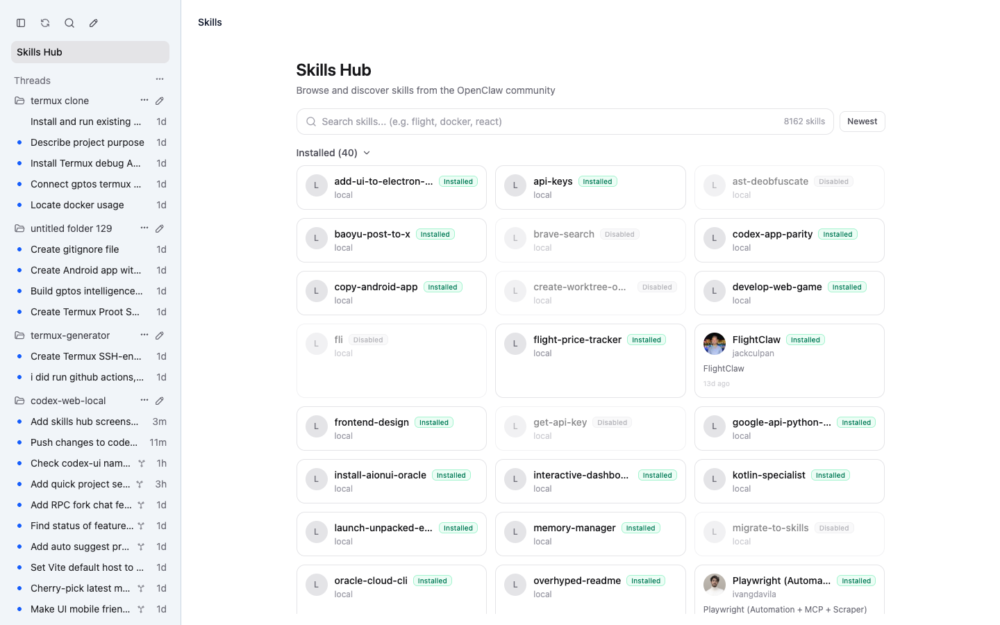
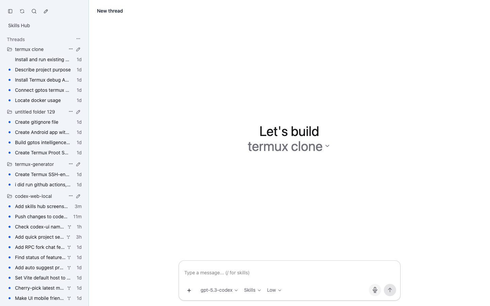
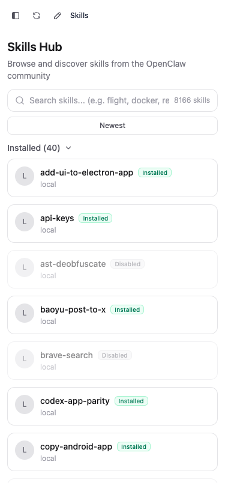
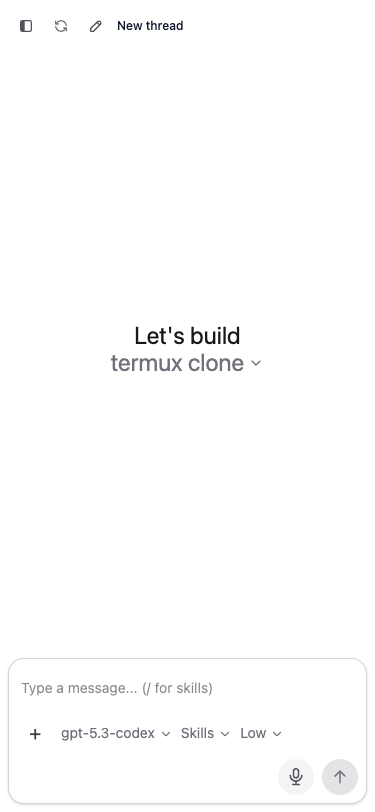

# Codex Remote · codex-mobile-remote

通过网页或 Android App，远程使用 Linux 主机上的 Codex，并与连接同一官方 app-server 的 Codex Desktop 同步。

[](https://github.com/scouthe/codex-mobile-remote/releases)
[](https://nodejs.org/)
[](./LICENSE)

最新功能以本仓库 `main` 为准。推荐使用[源码部署](#本地部署教程源码方式)；
[Releases](https://github.com/scouthe/codex-mobile-remote/releases) 中的 APK 和 Linux 包是单独发布的版本，
合并到 `main` 不会自动更新这些安装包。上游 npm 包 `codexapp` 也不代表本仓库的最新代码。

## 相对原仓库的修改与优化

本仓库基于 [friuns2/codex-mobile](https://github.com/friuns2/codex-mobile)，
主要部署在运行官方 Codex CLI 的 Linux 主机上。网页、Android App 和 Windows
Codex Desktop 通过各自的连接方式使用同一台主机上的官方服务。

- **官方 app-server 共享连接**：默认连接
  `$CODEX_HOME/app-server-control/app-server-control.sock`，通过官方
  `codex app-server proxy` 转发，不修改 Desktop 配置，不注入新的 provider、模型或权限策略。
- **官方服务自动引导**：标准 socket 尚未启动时，自动启动官方
  `codex app-server --listen unix://`，等待 socket 就绪后再连接；不会启动旧版
  standalone 替代服务，也不会创建第二套 Codex 会话状态。
- **跨客户端同步**：网页端与官方 Codex 客户端共享项目、历史对话、运行状态、审批/输入请求和任务事件；
  支持 Desktop/手机同时观察同一任务，网页创建的新对话和标题可在 Desktop 中识别。
- **任务与发送稳定性**：统一排队、发送、引导（steer）、停止（interrupt）路由，处理重复提交、
  服务重启恢复、writer 冲突和空闲会话误入队列等情况。
- **历史记录与切换性能**：项目/线程分页、快速状态投影、延迟加载大型历史对话，减少切换会话时的卡顿和状态回退。
- **按回复创建分支（Fork）**：使用官方 `thread/fork`，保留截至所选轮次的历史；
  后续轮次正在运行时仍可从历史已结束回复创建分支，只限制目标轮次正在执行。
  提供创建进度、失败原因和重复点击保护，新分支无需发送消息即可出现在会话列表中。
- **目标与失败重试**：接入官方 `thread/goal/*`，同步目标状态；对可重试的临时故障提供倒计时和手动立即重试。
- **移动端阅读**：思考、进度说明和命令过程默认折叠，最终回复单独展示；
  到达历史顶部时自动加载更早消息，右侧提示词导航支持手机先预览再跳转。
- **Android 客户端**：保存多个内网、公网或 Tailscale 地址，启动时探测并选择响应最快的可达地址；
  连接失败后可打开配置修改地址。App 专用本地对话缓存加快首次显示，服务器仍是最新状态来源。
- **终端与文件**：在主机项目目录运行交互式终端，浏览、编辑文件及导入导出项目。
- **星桥公网访问**：首次设置网页密码后，输入管理员发放的激活码，自动绑定设备并配置 FRPC；
  支持分配 HTTPS 地址、续费、重启连接和停止公网访问。
- **访问保护**：首次打开网页可设置密码或选择仅局域网模式；密码登录连续失败 5 次后冷却 10 分钟。
  单次文件附件上传请求体上限为 25 MiB。
- **兼容原有功能**：保留上游的项目管理、Skills、文件浏览、导入导出、Telegram 和隧道能力；
  账号刷新所需的临时隔离 app-server 仍然保留。已移除未使用的 Composio SDK、Firebase
  登录依赖和旧的无关展示页，GitHub Device Login 及调用外部 CLI 的 Composio 功能仍保留。

## 当前功能与使用入口

| 功能 | 使用方式与边界 |
| --- | --- |
| 对话与任务状态 | 侧栏显示活动状态；任务中心区分 `queued`、`starting`、`running`、`waiting_approval`、`waiting_user_input`、`steering`、`completed`、`failed`、`canceled`。 |
| 发送 / 引导 / 停止 | 普通发送在已有任务执行时默认排队；显式引导调用 `turn/steer`，停止调用 `turn/interrupt`。审批和输入请求通过对应卡片处理。 |
| 从回复 Fork | 点击助手回复下方的双箭头；历史已完成、失败或中断轮次可以创建分支，正在执行的目标轮次不可用。原线程继续运行。 |
| 目标模式 | 在输入框 `+` 菜单打开 Goal，保存、编辑、暂停/恢复或清除目标；需要官方服务支持目标接口。 |
| 临时故障重试 | 网页提交的请求遇到可恢复故障时显示重试倒计时和立即重试按钮；不对所有错误或其他客户端请求盲目重放。 |
| 对话内跳转 | 右侧竖排短线对应已加载的用户提示词；桌面悬停预览、点击跳转，手机点击先预览，再点标记或预览卡片跳转。 |
| 更早历史 | 手机滚动到顶部自动加载；已有缓存优先展开。大型对话分批读取，未加载的历史不会一次性全部渲染。 |
| Android 缓存 | 仅 App 启用 IndexedDB 快照，最多 20 个线程、每线程 200 条消息；按服务器 origin 隔离，在设置中可清除。不是完整离线运行模式。 |
| 项目终端 | 线程页顶部终端入口或 `Ctrl+J` / `Cmd+J`，支持 PTY、多标签和项目快捷命令；命令执行在 Codex 主机上，需要 `node-pty` 可用。 |
| 项目与文件 | 选择已有目录、新建或导入项目，浏览/编辑主机文件，导入导出包含对话历史的项目 ZIP。 |
| 远程连接 | 局域网直接访问；Tailscale 私网访问；星桥经 FRP + HTTPS 公网访问。多地址择优连接不等于把多台主机的线程汇总到一个页面。 |

### 当前架构

```text
浏览器 / Android App
    ├── 局域网地址
    ├── Tailscale 地址 / Serve HTTPS
    └── 星桥公网 HTTPS → 中转服务器 → 本机 FRPC
                                  ↓
                    Linux：codexapp :5900
                                  ↓
                    官方 codex app-server proxy
                                  ↓
                    官方 app-server 共享 socket
                                  ↑
                    Windows Codex Desktop 经 SSH 连接
```

关闭 Windows Desktop 不等于停止主机上的官方 app-server；各客户端的同步以连接到
同一官方服务为前提。星桥管理员后台和公网 FRPS/Caddy 属于独立部署，当前仓库包含用户端接入能力。

## Linux 一键安装脚本（需要发布包）

仓库提供安装脚本及 Linux 运行包构建流程。使用预构建包时不需要 pnpm 或手动创建
systemd 服务；仍需要预先安装 Node.js 和能正常使用的官方 Codex CLI。
脚本只安装 Codex Remote 自身，并使用本机的 `CODEX_HOME` 和官方 app-server socket。

先在 [Releases](https://github.com/scouthe/codex-mobile-remote/releases) 中确认目标版本有
`codexapp-linux-amd64.tar.gz`（或对应架构包）和 `SHA256SUMS`；如果只有 APK，
请使用下面的源码部署方式。脚本存在不代表最新 Release 已上传 Linux 运行包。

先下载脚本并检查内容，再执行：

```bash
curl -fsSL https://raw.githubusercontent.com/scouthe/codex-mobile-remote/main/install.sh -o install.sh
less install.sh
bash install.sh
```

安装脚本会检查 Linux 架构、Node.js 18+ 和官方 `codex` 命令，安装到
`~/.local/share/codexapp`；用户级 systemd 可用时创建 `codexapp-5900.service`，
否则回退为后台进程，并输出局域网地址。后台进程回退不提供 systemd 自动重启保障。
它不会修改 `~/.codex/auth.json`、`config.toml`、项目记录或官方 Codex 安装。
运行时仍会按需引导尚未启动的官方 app-server。默认关闭 Cloudflare 自动隧道。

首次打开网页时完成访问密码设置，然后进入“设置 → 星桥”输入管理员发放的激活码，
即可由现有 StarBridge 流程配置 FRPC 并获得公网访问地址。公网使用必须设置网页
访问密码；不设置密码时只能用于受信任的局域网环境。

指定有 Linux 运行包的 Release 标签时，可使用：

```bash
CODEXAPP_VERSION="vX.Y.Z" bash install.sh
```

将 `vX.Y.Z` 替换为实际有对应 Linux 运行包的标签。

离线安装时，将对应架构的发布包放在本机：

```bash
CODEXAPP_ARCHIVE="$PWD/codexapp-linux-amd64.tar.gz" bash install.sh
```

离线包也可以通过 `CODEXAPP_SHA256=<sha256>` 做强校验；发布包对应的校验值位于
同一 Release 的 `SHA256SUMS` 文件中。

默认端口和安装目录可以调整，例如局域网测试：

```bash
CODEXAPP_PORT=5910 CODEXAPP_INSTALL_ROOT="$HOME/.local/share/codexapp-test" bash install.sh
```

星桥当前下发并校验 `localPort=5900`，需要公网激活时请保持默认 5900。
安装器的 service 名固定为 `codexapp-5900.service`；在已有部署旁测试时设置
`CODEXAPP_SKIP_SERVICE=1`，避免覆盖已使用的 unit。

网络受限时，可以把 `CODEXAPP_RELEASE_BASE_URL` 指向管理员提供的 HTTPS 发布镜像；
安装脚本仍会优先校验发布包的 `SHA256SUMS`：

```bash
CODEXAPP_RELEASE_BASE_URL="https://mirror.example/releases" bash install.sh
```

## 本地部署教程（源码方式）

下面的流程适用于把 `codex-mobile-remote` 部署在运行 Codex CLI 的 Linux
电脑上。网页端、手机浏览器和 Android 客户端都连接这台电脑上的
`codexapp:5900`；Codex CLI、官方 app-server 和项目文件不会被复制到手机上。

### 1. 准备环境

需要准备：

- Linux 主机，使用官方 app-server Unix socket；
- Node.js 18 或更高版本，推荐 Node.js 22；
- `pnpm` 10；
- 已安装并能正常运行的官方 Codex CLI。

先确认版本：

```bash
node --version
pnpm --version
codex --version
```

如果本机还没有 `pnpm`，可以使用 Node.js 自带的 Corepack：

```bash
corepack enable
corepack prepare pnpm@10 --activate
```

首次使用 Codex CLI 时先完成登录；已经配置好第三方兼容 API 的用户可以
沿用自己的 Codex 配置，不需要在 `codexapp` 里重复配置模型：

```bash
codex login
```

### 2. 获取源码并构建

```bash
git clone https://github.com/scouthe/codex-mobile-remote.git
cd codex-mobile-remote
pnpm install
pnpm run build
```

更新已有源码部署时，在工作区干净的前提下使用：

```bash
git pull --ff-only
pnpm install
pnpm run build
systemctl --user restart codexapp-5900.service
```

### 3. 启动本地服务

先在终端验证服务能正常启动，不传 `--password` 或 `--no-password`，让网页端完成访问方式
设置；已有 Codex 登录或 provider 配置时使用 `--no-login` 跳过自动登录引导：

```bash
node dist-cli/index.js --no-login --no-tunnel --no-open --port 5900
```

打开终端中显示的地址，通常是：

```text
本机：      http://127.0.0.1:5900
局域网：    http://<这台电脑的局域网 IP>:5900
```

服务默认监听 `0.0.0.0:5900`，因此可通过本机、局域网和 Tailscale IP 访问。
这条前台命令适合检查启动情况；长期运行请使用第 5 步的 systemd，避免依赖 SSH 或工具终端。

首次打开时可以选择：

- **设置访问密码**：适合公网中转、反向代理、Cloudflare Tunnel 或其他不完全可信的网络；
- **仅局域网使用**：不设置密码，只允许本机、私有局域网和受信任的 Tailscale 地址访问。

`--no-password` 会直接关闭网页认证，只适合完全可信且不会被转发到公网的环境。
启用星桥公网访问前，必须设置网页访问密码。

### 4. 确认连接的是官方 app-server

这个项目默认复用官方 Codex app-server，不会为网页端创建第二套会话服务。
确认本机使用的是同一个 `CODEX_HOME` 和官方 socket：

```bash
curl -fsS http://127.0.0.1:5900/codex-api/app-server/status
```

响应结构如下（`running` 和 `generation` 随连接状态变化）：

```json
{
  "data": {
    "mode": "shared-proxy",
    "running": false,
    "socketAvailable": true
  },
  "generation": 0
}
```

`data.running` 表示 codexapp 的官方 proxy 子进程是否已启动；首次 RPC 前可以为 `false`，
它不是官方服务是否存活的直接标志。确认模式、socket 可用性，并用实际请求验证连接。

默认 socket 是：

```text
$CODEX_HOME/app-server-control/app-server-control.sock
```

如果官方 app-server 尚未启动，codexapp 会在首次请求时按官方命令自动引导；
也可以手动指定其他官方 socket：

```bash
node dist-cli/index.js \
  --no-tunnel \
  --port 5900 \
  --app-server-socket "${CODEX_HOME:-$HOME/.codex}/app-server-control/app-server-control.sock"
```

如果要和其他 Codex 客户端同步，所有客户端最终都必须连接同一台运行 Codex
的主机，并使用同一个 `CODEX_HOME` 和官方 app-server。

### 5. 让服务在后台常驻（Linux）

结束第 3 步的前台检查进程（`Ctrl+C`）后，再安装仓库提供的用户级 systemd 示例，
避免两个进程争用 5900：

```bash
mkdir -p ~/.config/systemd/user
install -m 0644 deploy/systemd/codexapp-5900.service \
  ~/.config/systemd/user/codexapp-5900.service
```

安装后先编辑这个文件，至少检查以下项目：

- `WorkingDirectory` 是否指向当前仓库目录；
- `ExecStart` 使用的 Node.js 是否是本机实际路径；
- `CODEX_HOME` 是否和官方 Codex CLI 使用的目录一致；
- 示例不带 `--no-password`；首次打开页面时选择设置密码或仅局域网使用。

长期部署建议添加自动恢复配置：

```bash
systemctl --user edit codexapp-5900.service
```

在打开的编辑器中写入：

```ini
[Service]
Restart=always
RestartSec=2
```

仓库示例及安装器当前使用 `Restart=on-failure`；上述本机 override 改为 `always`，
可以覆盖程序收到信号后以退出码 0 正常退出的情况。执行 `systemctl --user stop`
仍会保持停止，不会被自动拉起。

然后启动：

```bash
systemctl --user daemon-reload
systemctl --user enable --now codexapp-5900.service
systemctl --user status codexapp-5900.service --no-pager
```

查看日志或重启：

```bash
journalctl --user -u codexapp-5900.service -f
systemctl --user restart codexapp-5900.service
```

为用户开启 linger，使服务可在开机后、未登录或退出 SSH 时继续运行：

```bash
sudo loginctl enable-linger "$USER"
```

部署后确认 `systemctl --user status` 显示 `active (running)`，并检查首页和认证设置：

```bash
curl -I http://127.0.0.1:5900/
curl -fsS http://127.0.0.1:5900/auth/status
```

### 6. 配置手机或其他客户端

在同一局域网内，手机浏览器直接访问：

```text
http://<Linux 主机的局域网 IP>:5900
```

Android 原生客户端需要填写完整的 `codexapp` 地址，例如：

```text
http://192.168.1.148:5900
```

使用私网 HTTP 地址时，需要在 App 中允许未加密 HTTP；公网连接使用 HTTPS。

如果使用 Tailscale，请先让手机和 Linux 主机加入同一个 tailnet，再按照
[Tailscale Serve 部署教程](#tailscale-serve-deployment-private-remote-access)
发布 `5900`。如果使用星桥公网中转，在网页 Settings → StarBridge 中输入
管理员发放的激活码；设备密钥和 FRPC 配置只保存在 Linux 主机上。

### 7. 常见问题

`5900` 已被占用：

```bash
ss -ltnp | rg ':5900'
```

如果已经由 systemd 托管，更新后直接重启，不要再另开一个 `node` 或 `nohup` 进程：

```bash
systemctl --user restart codexapp-5900.service
```

只有切回前台调试时才停止 systemd：

```bash
systemctl --user stop codexapp-5900.service
```

`5900` 连接被拒绝时检查服务和日志：

```bash
systemctl --user status codexapp-5900.service --no-pager
journalctl --user -u codexapp-5900.service -n 80 --no-pager
ss -ltnp | rg ':5900'
```

如果 `MainPID=0`、服务为 `inactive`，使用 `systemctl --user start codexapp-5900.service`
恢复。代码更新、服务重启和官方 app-server 重启是不同操作；仅更新网页功能一般只需重启 5900。

页面提示前端资源缺失：

```bash
pnpm run build
```

页面能打开但 Codex 请求失败，先检查：

```bash
curl -fsS http://127.0.0.1:5900/codex-api/app-server/status
echo "$CODEX_HOME"
ls -l "${CODEX_HOME:-$HOME/.codex}/app-server-control/"
```

重点确认服务进程和官方 Codex CLI 使用同一个 Linux 用户、`CODEX_HOME` 及
app-server socket。不要再额外启动一个独立的 app-server，否则会产生不同的
会话状态和 writer 冲突。

### 推荐的源码启动方式

```bash
pnpm install
pnpm run build
node dist-cli/index.js --no-login --no-tunnel --no-open --port 5900
```

默认情况下不需要手动查找或填写 app-server socket。只要官方 Codex CLI 和登录配置正常，
首次请求会自动连接现有官方服务，或按需启动它。

```text
 ██████╗ ██████╗ ██████╗ ███████╗██╗  ██╗██╗   ██╗██╗
██╔════╝██╔═══██╗██╔══██╗██╔════╝╚██╗██╔╝██║   ██║██║
██║     ██║   ██║██║  ██║█████╗   ╚███╔╝ ██║   ██║██║
██║     ██║   ██║██║  ██║██╔══╝   ██╔██╗ ██║   ██║██║
╚██████╗╚██████╔╝██████╔╝███████╗██╔╝ ██╗╚██████╔╝██║
 ╚═════╝ ╚═════╝ ╚═════╝ ╚══════╝╚═╝  ╚═╝ ╚═════╝ ╚═╝
```

---


## 🤯 What Is This?
**`codexapp`** is a lightweight bridge that gives you a browser-accessible UI for Codex app-server workflows.

You run one command. It starts a local web server. You open it from your machine, your LAN, or wherever your setup allows.  

**TL;DR 🧠: Codex app UI, unlocked for Linux, Windows, and Termux-powered Android setups.**

---

## ⚡ Quick Start

Use this repository's source checkout for the current fork features:

```bash
git clone https://github.com/scouthe/codex-mobile-remote.git
cd codex-mobile-remote
pnpm install
pnpm run build
node dist-cli/index.js --no-login --no-tunnel --no-open --port 5900

# 🌐 Then open in browser
# http://localhost:5900
```

The service binds to `0.0.0.0:5900`. Configure the web password on first access,
then use systemd for persistent Linux deployments. The public npm package
`codexapp` belongs to the upstream distribution; `npx codexapp` does not install
this repository's current `main`.

Cloudflare Tunnel is a retained optional integration. The CLI's legacy auto
mode tries to enable it when a Tailscale IP is detected. The installer, systemd
example, and recommended commands use `--no-tunnel` explicitly. To opt in:

```bash
node dist-cli/index.js --tunnel --port 5900
```

When available, cloudflared forwards to the local web port and prints the tunnel
URL and QR code. This is separate from Tailscale Serve and StarBridge.

If you are using a provider or AI gateway that is already authenticated and do not want `codexapp` to force `codex login` during startup, use:

```bash
node dist-cli/index.js --no-login --no-tunnel --port 5900
```

### Use the official Codex app-server (required)

This branch does not start a second app-server. It attaches to the existing
official Codex app-server on the Ubuntu host and uses the official CLI proxy
command, so Desktop and the web UI share provider configuration, permissions,
conversation state, and task events:

```bash
node dist-cli/index.js --no-login --no-tunnel --port 5900
```

The official app-server socket is used directly. If it is not running yet,
codexapp starts the official `codex app-server --listen unix://` process,
waits for the standard socket, and then connects through the official proxy.
You can use the equivalent CLI option to point at a non-default socket:

```bash
node dist-cli/index.js --no-login --no-tunnel \
  --app-server-socket "${CODEX_HOME:-$HOME/.codex}/app-server-control/app-server-control.sock"
```

By default codexapp uses `$CODEX_HOME/app-server-control/app-server-control.sock`
(`~/.codex/app-server-control/app-server-control.sock` when `CODEX_HOME` is not
set). Override it with `CODEXUI_APP_SERVER_SOCKET` or
`--app-server-socket` when the official socket lives elsewhere. If startup
fails, the web service remains available for diagnostics and reports the
official app-server error; codexapp never starts a separate replacement
bridge. Once the official socket is available, retry the request and
codexapp reconnects through the proxy. Check the active mode with:

```bash
curl http://127.0.0.1:5900/codex-api/app-server/status
```

The response reports `data.mode: "shared-proxy"`; `data.running` describes the
bridge's proxy child, not a standalone app-server. Do not change the Windows Desktop
connection or the official app-server startup command.

### Keep the web service running (Linux)

To keep port 5900 available after the terminal that started codexapp closes,
install the included user-level systemd unit:

```bash
mkdir -p ~/.config/systemd/user
install -m 0644 deploy/systemd/codexapp-5900.service \
  ~/.config/systemd/user/codexapp-5900.service
systemctl --user daemon-reload
systemctl --user enable --now codexapp-5900.service
```

The unit expects this checkout at `~/common/codex-mobile-remote` and Node.js
22.22.1 under `~/.nvm`; adjust `WorkingDirectory`, `ExecStart`, and `PATH` if
your local paths differ. See [the source deployment guide](#5-让服务在后台常驻linux)
for a `Restart=always` override and login linger. Check or restart it with:

```bash
systemctl --user status codexapp-5900.service
systemctl --user restart codexapp-5900.service
```

The main bridge always connects through `codex app-server proxy`; it bootstraps
the official shared service only when needed. Account refresh can still use an
isolated temporary app-server. Optional terminals and relay services create
their own subprocesses.

The following platform commands describe the upstream npm package, not the
recommended installation route for this fork:

### Linux 🐧
```bash
node -v   # should be 18+
npx codexapp
```

### Windows 🪟 (PowerShell)
```powershell
node -v   # 18+
npx codexapp
```

### Termux (Android) 🤖
```bash
pkg update && pkg upgrade -y
pkg install nodejs -y
npx codexapp
```

Android background requirements:

1. Keep `codexapp` running in the current Termux session (do not close it).
2. In Android settings, disable battery optimization for `Termux`.
3. Keep the persistent Termux notification enabled so Android is less likely to kill it.
4. Optional but recommended in Termux:
```bash
termux-wake-lock
```
5. Open the shown URL in your Android browser. If the app is killed, return to Termux and run `npx codexapp` again.

---

## Native Android Remote Client

This repository also includes an optional native Android shell in [`android/`](./android/).
It connects to the `codexapp` bridge running on your computer; Codex CLI and the
official app-server continue to run only on that computer. The APK reuses the
existing web UI and shared-observer protocol, so it can display the same projects,
conversation history, task progress, queue, approvals, and user-input requests.

The remote client does not install Termux, Node.js, Codex CLI, or a second
app-server on the phone. It saves multiple LAN, public HTTPS, and Tailscale
addresses, probes them on launch, and selects the fastest reachable endpoint.
Connection settings remain accessible after a failed connection so addresses
can be selected, added, or corrected. It also provides encrypted credential
storage, reconnect after network changes, native notifications, file picker,
share-sheet intake, clipboard, and Android back navigation.

App-only conversation snapshots are cached in IndexedDB by server origin,
bounded to 20 threads and 200 messages per thread. Cached content appears first,
then the server revision is checked. Ordinary browsers do not enable this
conversation snapshot cache. Clear it from **Settings → Clear App conversation
cache** without deleting connection profiles.

Use the connection settings button in the top toolbar to manage addresses.
Updating the Vue conversation UI or cache logic requires rebuilding the host's
web assets and refreshing/reopening the App; changes to Kotlin/native connection
handling require installing a new APK. See [Releases](https://github.com/scouthe/codex-mobile-remote/releases)
for published APKs; an older APK does not necessarily contain the newest native features.

Build a debug APK from the repository root:

```bash
pnpm install
pnpm run build:frontend
pnpm run build:cli
cd android
./gradlew assembleDebug
```

The APK is written to
`android/app/build/outputs/apk/debug/app-debug.apk`. For setup, security notes,
and the native bridge contract, see [`android/README.md`](./android/README.md).

## StarBridge user client (Linux)

The web Settings panel includes an optional **StarBridge** entry for
users who have received an administrator-issued activation code. It activates
the Linux host that runs Codex, installs the pinned official FRPC release after
SHA256 verification, writes a per-device OIDC configuration with private file
permissions, and manages FRPC through a systemd user unit (with a detached
process fallback on minimal Linux).

The browser only sends the one-time code to the local codexapp server and
receives the assigned public domain and subscription status. Device secrets and
the FRPC configuration remain on the Linux host. Codexapp must have a web
password before public relay access can be activated. The control plane should
use HTTPS in production; private HTTP addresses are accepted only for LAN
testing. Renewal, restart, and stop controls are available in the same panel.
If GitHub downloads are slow in your region, an administrator can provide an
HTTPS mirror by setting `CODEXUI_FRPC_DOWNLOAD_BASE_URL`; the client still
verifies the official release checksum before installing the binary.

---

## Tailscale Serve deployment (private remote access)

Tailscale Serve is the recommended way to reach `codexapp` from a phone or
another computer without opening port `5900` to the public Internet. It creates
an HTTPS endpoint that is available only to devices in your tailnet. The same
endpoint works in a mobile browser, iPhone/iPad Safari, or the native Android
Remote APK.

The connection path is:

```text
Android / browser
        │ HTTPS (Tailscale Serve, tailnet only)
        ▼
Ubuntu: codexapp :5900
        │ official app-server proxy + Unix socket
        ▼
Ubuntu: official Codex app-server
        ▲
        │ SSH
Windows Codex Desktop
```

### 1. Prepare the computer that runs Codex

Install and authenticate Tailscale on the same computer that owns the Codex
CLI and this checkout. Verify that the daemon is connected:

```bash
tailscale version
tailscale status
tailscale ip -4
```

On a new Linux installation, start the daemon and authenticate it using the
normal Tailscale flow:

```bash
sudo systemctl enable --now tailscaled
sudo tailscale up
```

Do not paste an auth key, API key, or password into the repository or into a
public issue.

### 2. Build and keep `codexapp` running

From this repository, use the `main` branch and build the web bridge:

```bash
git switch main
pnpm install
pnpm run build
```

For a persistent Linux service, install the included user-level systemd unit
and start it:

```bash
mkdir -p ~/.config/systemd/user
install -m 0644 deploy/systemd/codexapp-5900.service \
  ~/.config/systemd/user/codexapp-5900.service
systemctl --user daemon-reload
systemctl --user enable --now codexapp-5900.service
systemctl --user status codexapp-5900.service --no-pager
```

Confirm that the bridge is attached to the official shared app-server:

```bash
curl -fsS http://127.0.0.1:5900/codex-api/app-server/status
```

The response should report `data.mode: "shared-proxy"` and a usable configured
socket. If the official app-server is not running, codexapp can bootstrap the
official process when the first request arrives; it never starts a separate
standalone replacement server.

### 3. Publish port 5900 inside the tailnet

Inspect any existing Serve configuration first, especially if this machine
already publishes another service:

```bash
tailscale serve status
```

Add the local bridge at the root of the machine's HTTPS hostname:

```bash
tailscale serve --bg 5900
tailscale serve status
```

Tailscale prints a URL similar to:

```text
https://scouthe.<your-tailnet>.ts.net
```

The command is persistent in Tailscale's configuration and does not expose a
new public Internet port. Do not run `tailscale serve reset` on a host that
also serves other applications unless you intend to remove their routes.

For a short-lived foreground test, omit `--bg` and stop it with `Ctrl-C` when
finished. Use `tailscale funnel` only if you deliberately want public Internet
exposure; it is not needed for this private remote client.

### 4. Connect from a browser or the Android APK

On the phone or client computer:

1. Install Tailscale and sign in to the same tailnet.
2. Verify that the Ubuntu device is reachable in the Tailscale app.
3. Open the HTTPS hostname printed by `tailscale serve status`.

For the native Android client, build and install the APK if needed:

```bash
cd android
./gradlew assembleDebug
adb install -r app/build/outputs/apk/debug/app-debug.apk
```

Open **Codex Remote**, save the complete `https://...ts.net` URL, and tap
**Connect fastest** (or select an address manually). The APK stores addresses and optional codexapp passwords for
future launches, reconnects after Wi-Fi/Tailscale changes, and keeps Codex
execution on the computer. It does not install Codex CLI or another
app-server on Android.

The included systemd unit preserves first-run password setup and does not use
`--no-password`. Enter the codexapp password if configured, or leave the App's
password field empty and sign in through the page. Tailscale connectivity and
the codexapp web password are separate controls.

### 5. iPhone / iPad Safari

Open the same Tailscale HTTPS URL in Safari. HTTPS provides the secure context
needed by mobile browser features such as dictation and **Add to Home Screen**.
The browser and Android APK both see the same projects, conversation history,
task progress, queue, approvals, and user-input requests through `codexapp`.

### Troubleshooting Tailscale connections

```bash
# Tailscale routing and Serve configuration
tailscale status
tailscale serve status

# Local bridge and official app-server health
curl -fsS http://127.0.0.1:5900/codex-api/app-server/status
curl -fsS "https://<machine>.<your-tailnet>.ts.net/codex-api/app-server/status"
```

- If the local URL works but the HTTPS URL does not, check that both devices
  are signed in to the same tailnet and that Tailscale ACLs allow access.
- If the page loads but Codex requests fail, check the local status response,
  the official socket path, and `journalctl --user -u codexapp-5900.service`.
- If Android asks for a password, that is the codexapp authentication layer,
  not a Tailscale password. Supply the password chosen during first-run web
  setup; it can also be changed in web Settings.

---

## ✨ Features
> **The payload.**

- 🚀 Source deployment and a Linux installer for published runtime archives
- 🌍 Cross-platform support for Linux, Windows, and Termux on Android
- 🖥️ Browser-first Codex UI on `http://localhost:5900`
- 🌐 LAN-friendly access from other devices on the same network
- 🧪 Remote/headless-friendly setup for server-based Codex usage
- 🔌 Works with reverse proxies and tunneling setups
- ⚡ No global install required for quick experimentation
- 🎙️ Built-in hold-to-dictate voice input with transcription to composer draft
- 🤖 Optional Telegram bot bridge: send messages to bot, forward into mapped thread, send assistant reply back to Telegram
- 💾 Project portability: export a project as a ZIP from project or thread menus, including matching Codex chat JSONL history under `.codex-project/chats/`
- 📦 Project import: restore exported project ZIPs from the browser via `Import Project`
- 🔁 Imported chats are rewritten for the destination `CODEX_HOME`, project path, and currently selected provider/model so they can be resumed in the new environment
- ⚙️ Project ZIP performance: exports stream ZIP bytes with response backpressure handling and skip generated/git-ignored folders; imports still buffer the selected ZIP once because the browser upload arrives as a single file

### Telegram Bot Bridge (Optional)

Set these environment variables before starting `codexapp`:

```bash
export TELEGRAM_BOT_TOKEN="<your-telegram-bot-token>"
export TELEGRAM_ALLOWED_USER_IDS="<your-telegram-user-id>,<optional-second-id>"
export TELEGRAM_DEFAULT_CWD="$PWD" # optional, defaults to current working directory
node dist-cli/index.js --no-login --no-tunnel --port 5900
```

`TELEGRAM_ALLOWED_USER_IDS` is required for safe access. Only allowlisted Telegram user IDs can use the bridge. If no allowed user IDs are configured, incoming Telegram messages are rejected.

To find your Telegram user ID:

1. Send a message to your bot.
2. Run `curl "https://api.telegram.org/bot<your-telegram-bot-token>/getUpdates"`.
3. Read `message.from.id` from the returned update payload.

Bot commands:

- `/start` show quick help and thread picker
- `/threads` list recent threads and pick one
- `/newthread` create and map a new Codex thread for this Telegram chat
- `/thread <threadId>` map current Telegram chat to an existing thread
- `/current` show currently connected thread for this chat
- `/history` show recent history for current thread
- `/status` show bridge/mapping status
- `/whoami` show your Telegram user/chat IDs and authorization state
- `/help` show command reference

Outgoing assistant messages are sent with Telegram `parse_mode=HTML` for formatting, with automatic plain-text fallback if HTML delivery fails.

---

## Current conversation workflow

- Share the official app-server with Codex Desktop, including web-created threads and their names.
- Queue ordinary messages during active work; use separate steer and interrupt actions.
- Fork through a historical completed reply while a later turn runs, with creation feedback and duplicate-click protection.
- Fold commentary and command details beneath a per-turn process summary while keeping final answers visible.
- Jump between loaded prompts using the vertical rail; touch devices preview before jumping.
- Automatically load older messages on mobile and restore bounded App-only conversation snapshots.
- Manage goals through the official Goal API when supported, and retry eligible transient failures from the web client.
- Keep the service under user systemd, and access it through LAN, Tailscale, or the activated StarBridge relay.

---

## 🌍 What Can You Do With This?

| 🔥 Use Case | 💥 What You Get |
|---|---|
| 💻 Linux workstation | Run Codex UI in browser without depending on desktop shell |
| 🪟 Windows machine | Launch web UI and access from Chrome/Edge quickly |
| 📱 Termux on Android | Start service in Termux and control from mobile browser |
| 🧪 Remote dev box | Keep Codex process on server, view UI from client device |
| 🌐 LAN sharing | Open UI from another device on same network |
| 🧰 Headless workflows | Keep terminal + browser split for productivity |
| 🔌 Custom routing | Put behind reverse proxy/tunnel if needed |
| ⚡ Fast experiments | Build this checkout and run `node dist-cli/index.js` |

---

## 🖼️ Screenshots

### Skills Hub


### Chat


### Mobile UI



---

## 🏗️ Architecture

```text
┌─────────────────────────────┐
│  Browser (Desktop/Mobile)   │
└──────────────┬──────────────┘
               │ HTTP/WebSocket
┌──────────────▼──────────────┐
│         codexapp            │
│  (Express + Vue UI bridge)  │
└──────────────┬──────────────┘
               │ official `codex app-server proxy`
               │ Unix control socket
┌──────────────▼──────────────┐
│   Official Codex App Server  │
│  auto-started when missing   │
└─────────────────────────────┘
```

The Windows Codex Desktop client and codexapp can use the same official app-server
on the Ubuntu host. codexapp does not replace or reconfigure the Desktop client.

---

## 🎯 Requirements
- ✅ Node.js `18+`
- ✅ Codex app-server environment available
- ✅ Browser access to host/port
- ✅ Microphone permission (only for voice dictation)

---

## 🐛 Troubleshooting

| ❌ Problem | ✅ Fix |
|---|---|
| Port already in use | Run on a free port or stop old process |
| `npx` fails | Update npm/node, then retry |
| Termux install fails | `pkg update && pkg upgrade` then reinstall `nodejs` |
| Can’t open from other device | Check firewall, bind address, and LAN routing |

## 验证与发布

验证源码构建和单元测试：

```bash
pnpm run test:unit
pnpm run build
```

分功能的手动验收记录见 [tests.md](./tests.md) 和 [tests/](./tests/)。

GitHub Actions 当前仅手动触发。`Build Linux installer` 构建运行包，填写
`release_tag` 时发布到 Release；不填写时只生成 Actions artifact。`Build Android remote client`
构建 APK artifact，在 `main` 上执行不会自动创建 APK Release。

维护者也可以在 Linux 本机构建离线运行包：

```bash
scripts/build-linux-release.sh release
```

输出包含对应架构的 `codexapp-linux-*.tar.gz` 和 `SHA256SUMS`。
修改 Web 前端和桥接逻辑后需要重新构建主机资源；仅修改 README 不需要重启 5900。

---

## 🤝 Contributing
Issues and PRs are welcome.  
Bring bug reports, platform notes, and setup improvements.

---

## ⭐ Star This Repo
If you believe Codex UI should be accessible from **any machine, any OS, any screen**, star this project and share it. ⭐

<div align="center">
Built for speed, portability, and a little bit of chaos 😏
</div>

---

Forked from [pavel-voronin/codex-web-local](https://github.com/pavel-voronin/codex-web-local) by Pavel Voronin.
